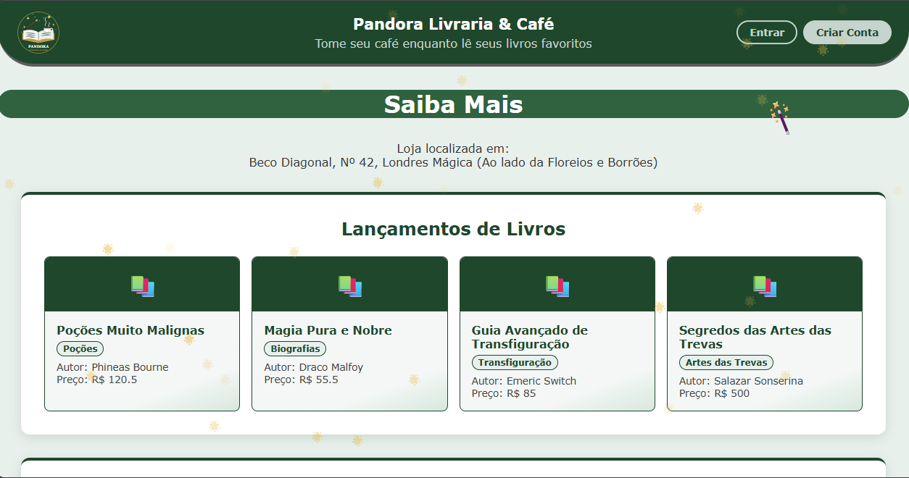

<p align="center">
  
</p>

<h1 align="center">📚☕ Pandora Livraria & Café</h1>

<p align="center">
  <em>Tome seu café enquanto lê seus livros favoritos, no coração do Beco Diagonal.</em>
</p>

<p align="center">
  <a href="https://pandora-livraria-e-cafe.onrender.com">
    
  </a>
</p>

<p align="center">
  
  
  
  
</p>

<p align="center">
  <a href="https://pandora-livraria-e-cafe.onrender.com">
    
  </a>
</p>

<p align="center">
  <sub>⏳ Hospedado no plano gratuito do Render: se o site ficar um tempo sem acessos, o primeiro carregamento pode levar cerca de 50 segundos para "acordar" o servidor.</sub>
</p>

---

Um projeto de estudo Full-Stack focado no desenvolvimento de um sistema web completo para uma livraria mágica fictícia do universo de **Harry Potter**, localizada no **Beco Diagonal**.

Este projeto foi construído do zero, **sem o uso de frameworks complexos**, com o objetivo principal de aprender e consolidar os fundamentos da web (Manipulação do DOM, requisições HTTP, modelagem de banco de dados e estilização estrutural).

## 🎯 Objetivo do Projeto (Produto Final)
O sistema final permitirá que os clientes naveguem pelo acervo de grimórios e livros mágicos, vejam os lançamentos, descubram promoções (de livros e do café) e façam login para reservar obras e retirar na loja física. Além disso, contará com um painel administrativo para controle interno do estoque e cadastro de novas campanhas.

## 🛠️ Tecnologias Utilizadas
* **Front-end:** HTML5, CSS3 puros (Grid e Flexbox) e Vanilla JavaScript.
* **Back-end:** Node.js (utilizando apenas os módulos nativos como `http`, `fs` e `crypto`, sem frameworks como Express, para aprofundamento técnico).
* **Armazenamento de dados:** Arquivos JSON (`dados/`), escolhidos para simplificar o deploy do MVP. A modelagem em MySQL está pronta em `database/setup.sql` para uma futura migração.
* **Segurança:** Senhas protegidas com hash `scrypt` e *salt* aleatório (módulo nativo `crypto`).
* **Hospedagem:** [Render](https://render.com) (plano gratuito), com deploy automático a cada `git push` na branch `master`.
* **Design:** Logo e favicon em SVG, criados exclusivamente para o projeto.

## 🚀 Funcionalidades do Sistema

### 🟢 O que já está implementado (MVP)
- [x] **Vitrine Dinâmica de Lançamentos:** Renderização de livros alimentados diretamente pelo banco de dados JSON (`dados/banco.json`), usando a tag `<template>` do HTML e manipulação segura via JavaScript.
- [x] **Vitrine de Promoções Ativas:** Exibe apenas as promoções cadastradas, buscadas do arquivo de dados em tempo real.
- [x] **API Backend:** Servidor próprio capaz de hospedar arquivos estáticos e prover rotas RESTful de dados (`/api/lancamentos`, `/api/promocoes`, `/api/destaques`).
- [x] **Interface Gráfica Temática:** Design baseado em *Cards* com paleta de cores da casa **Sonserina** (verde esmeralda e prata).
- [x] **Layout Responsivo:** Adaptado para computador, tablet e celular: no celular os livros e promoções aparecem em duas colunas compactas, os botões do cabeçalho passam para baixo do título e o rodapé fica sempre no fim da tela.
- [x] **Efeitos Visuais Mágicos:** Uso avançado de JavaScript para criar um brilho luminoso interativo (HTML5 Canvas) e partículas estelares, que reagem aos elementos da página. O brilho que segue o cursor só aparece para quem usa mouse (inclusive no celular ou tablet com mouse conectado) e fica desligado em telas de toque.
- [x] **Arquitetura Simplificada para Deploy:** Substituição do MySQL por leitura de arquivos `.json` para facilitar a hospedagem gratuita do MVP.
- [x] **Deploy no Ar:** Projeto publicado no Render, com atualização automática a cada `git push`.
- [x] **Identidade Visual:** Logo em SVG fixa no cabeçalho (com link para a página inicial) e favicon na aba do navegador.
- [x] **Páginas de Login e Cadastro:** Telas (`login.html` e `cadastro.html`) no mesmo tema visual da loja.
- [x] **Back-end de Autenticação:** Rotas `POST /api/cadastro` e `POST /api/login` com senhas criptografadas (`scrypt` + *salt*) e dois tipos de usuário (`cliente` e `admin`).
- [x] **Login e Cadastro Funcionando:** Os formulários enviam os dados à API, mostram mensagens de erro e, ao entrar, o cabeçalho exibe o nome do usuário com o botão "Sair".
- [x] **Contas de Teste Fixas:** Um cliente e um administrador sempre disponíveis para demonstração (veja a seção abaixo).
- [x] **Proteção de Arquivos Internos:** O servidor não entrega o código, a pasta `dados/` nem outros arquivos privados pelo navegador.
- [x] **API de Destaques:** Rota `/api/destaques` que retorna os livros mais bem avaliados e os mais vendidos.

### 🟡 O que está no Roadmap (Próximos Passos)
- [ ] **Sessão Segura de Usuário:** Hoje o login só guarda no navegador quem entrou (para mostrar "Olá, ..." no cabeçalho). Falta uma sessão validada pelo servidor para proteger áreas restritas (reservas e painel de admin).
- [ ] **Persistência dos Dados:** No plano gratuito do Render os arquivos JSON de usuários são apagados a cada novo deploy. Migrar para um MySQL em nuvem (usando o `database/setup.sql`) resolve isso.
- [ ] **Seção de Destaques na Página:** Exibir na tela inicial os dados que a rota `/api/destaques` já entrega.
- [ ] **Sistema de Reservas:** Interface para o usuário autenticado selecionar grimórios para retirada presencial.
- [x] **Migração do Front-end para React (em andamento):** Primeira parte migrada — a página "Minha Conta" (`perfil-app/`, React + Vite) já roda em produção junto com o restante do site em HTML puro, que continua sendo migrado por partes.
- [ ] **Painel da Equipe Completo:** Hoje `painel-funcionario.html` é só um placeholder estático. Falta o painel de verdade pra gerenciar estoque e promoções (provavelmente também em React).

## 🔑 Contas de Teste

Para experimentar o site sem precisar cadastrar nada, use uma destas contas (recriadas sempre que o servidor liga):

| Tipo | E-mail | Senha |
|---|---|---|
| Cliente | `cliente@gmail.com` | `cliente123` |
| Funcionário / Admin | `funcionario@pandoralivraria.com.br` | `equipe123` |

> O tipo da conta é definido pelo domínio do e-mail no cadastro: quem usa `@pandoralivraria.com.br` vira funcionário/admin, qualquer outro domínio (Gmail, Outlook, etc.) vira cliente.

> ⚠️ São contas públicas de demonstração, então nunca use nelas uma senha real. Contas criadas pelo formulário de cadastro são temporárias: no plano gratuito do Render elas somem quando o servidor reinicia ou dorme.

## 📂 Estrutura do Projeto

Abaixo está o mapa para você se encontrar dentro dos arquivos do projeto:

```text
📁 Raiz
 ├── 📁 CSS
 │    └── 📄 style.css              # Estilos visuais (tema Sonserina e UI)
 ├── 📁 JS
 │    ├── 📄 lancamento.js          # Busca e renderiza os lançamentos
 │    ├── 📄 promocoes.js           # Busca e renderiza as promoções ativas
 │    ├── 📄 auth.js                # Login, cadastro e saudação do usuário no cabeçalho
 │    ├── 📄 canvas.js              # Lógica da varinha mágica luminosa (Canvas 2D)
 │    └── 📄 magica.js              # Lógica das partículas e estrelas interativas
 ├── 📁 dados
 │    ├── 📄 banco.json             # Dados da livraria: livros e promoções (MVP)
 │    ├── 📄 usuarios.json          # Contas de usuários (criado automaticamente ao cadastrar)
 │    └── 📄 lancamentos.json       # Lançamentos cadastrados pela API (criado automaticamente)
 ├── 📁 database
 │    └── 📄 setup.sql              # Script guardado para futura migração para MySQL
 ├── 📁 imagens
 │    ├── 📄 logo.svg               # Logo do projeto (cabeçalho, favicon e README)
 │    └── 📄 preview.png            # Print do site usado no README
 ├── 📁 perfil-app                  # Código-fonte React (Vite) da página "Minha Conta"
 │    ├── 📁 src
 │    │    ├── 📄 main.jsx           # Ponto de entrada do React
 │    │    └── 📄 App.jsx            # Tela de perfil do cliente
 │    ├── 📄 index.html              # HTML base usado pelo Vite
 │    ├── 📄 vite.config.js          # Configuração de build (gera a pasta /perfil)
 │    └── 📄 package.json            # Dependências do app React (react, vite)
 ├── 📁 perfil                      # Build gerado do perfil-app (gerado por `npm run build:perfil`, servido em /perfil)
 ├── 📄 index.html                  # Página inicial da loja
 ├── 📄 login.html                  # Tela de login
 ├── 📄 cadastro.html               # Tela de criação de conta
 ├── 📄 painel-funcionario.html     # Painel da equipe (placeholder, área restrita a funcionário/admin)
 ├── 📄 testes.html                 # Página de testes de animação (desenvolvimento)
 ├── 📄 teste-canvas.html           # Página de testes do canvas (desenvolvimento)
 ├── 📄 servidor-estatico.js        # Backend (Servidor Node.js e rotas de API)
 ├── 📄 package.json                # Dependências e scripts (npm start, npm run build:perfil)
 ├── 📄 package-lock.json           # Versões exatas das dependências
 ├── 📄 .gitignore                  # Arquivos ignorados pelo Git (node_modules)
 ├── 📄 GUIA-SERVIDOR.md            # Documentação técnica de como o Node funciona
 └── 📄 README.md                   # Esta documentação
```

## 💻 Como Rodar o Projeto Localmente

Com a arquitetura em JSON, rodar o projeto é simples e não exige banco de dados externo. É necessário apenas ter o [Node.js](https://nodejs.org) instalado.

1. **Clone o repositório** e entre na pasta:
   ```bash
   git clone https://github.com/GehMay/Pandora-Livraria-E-Cafe.git
   cd Pandora-Livraria-E-Cafe
   ```
2. **Instale as dependências:**
   ```bash
   npm install
   ```
3. **Inicie o servidor:**
   ```bash
   npm start
   ```
4. Abra seu navegador e acesse: [http://localhost:5500](http://localhost:5500)

> 💡 A porta padrão é a `5500`. Se a variável de ambiente `PORT` estiver definida (como acontece no Render), o servidor usa o valor dela.

### ⚛️ Mexendo na parte em React (`perfil-app/`)

A página "Minha Conta" já é servida pronta (pasta `/perfil`, gerada previamente), então rodar `npm start` sozinho já é suficiente pra navegar no site inteiro. Só é preciso mexer no `perfil-app/` quando for alterar essa página:

1. **Modo desenvolvimento** (com hot reload, mas ainda precisa do servidor Node rodando em outro terminal pra API/CSS/imagens funcionarem):
   ```bash
   cd perfil-app
   npm install
   npm run dev
   ```
2. **Gerar o build de novo** depois de editar o React (o servidor Node só serve o que está na pasta `/perfil`, então esse passo é obrigatório antes de commitar):
   ```bash
   npm run build:perfil
   ```

---

## 👩‍💻 Autoria

Desenvolvido com dedicação por **Geovanna** como projeto prático de aprimoramento em Desenvolvimento Web Full-Stack.

---

## 📜 Licença

Este projeto está licenciado sob a **Creative Commons Attribution-ShareAlike 4.0 International (CC BY-SA 4.0)**.

Isso significa que você **pode**:
- ✅ Compartilhar — copiar e redistribuir o material em qualquer formato.
- ✅ Adaptar — remixar, transformar e criar a partir do material para qualquer finalidade.

Desde que você **respeite as seguintes condições**:
- 📌 **Atribuição:** Você deve dar o crédito apropriado à autora original (Geovanna), indicar se foram feitas alterações e fornecer um link para a licença.
- 📌 **CompartilhaIgual:** Se você remixar ou transformar este projeto, deve distribuir suas contribuições sob a **mesma licença** que o original.

Licença completa disponível em: https://creativecommons.org/licenses/by-sa/4.0/deed.pt
